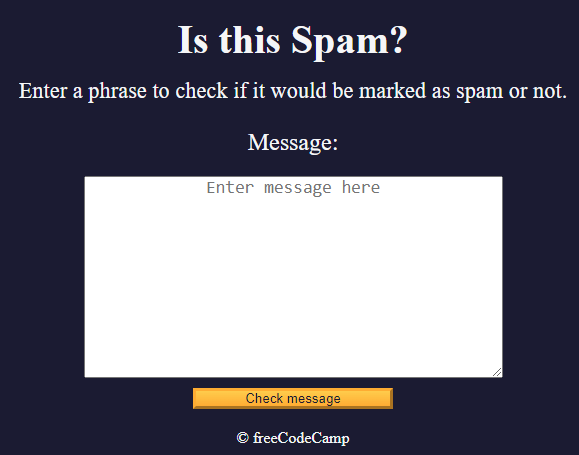

## FreeCodeCamo Project - Learn Regular Expressions by building a Spam Filter

In this spam filter project, I will learn about catch groups, positive lookaheads, negative lookaheads and other techniques to match any text I want.

[Deploy on GitHub Page](https://lquesadam.github.io/Spam-filter/)

[link to the project on FreeCodeCamp](https://www.freecodecamp.org/espanol/learn/javascript-algorithms-and-data-structures-v8/learn-regular-expressions-by-building-a-spam-filter/step-1)